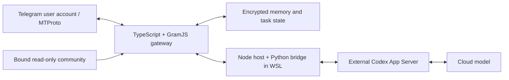

# Neurobro

**A Telegram AI assistant that participates through a real user account over MTProto.**

Neurobro connects a Telegram account to an agent runtime with conversation memory, tools and long-running tasks. It can respond to direct requests and replies, work with media, search conversations and optionally join a discussion on its own. **No BotFather bot or Telegram Bot API token is required for the account gateway.**

Built with AI coding agents, with author-led product design, architecture decisions, integration and testing in real Telegram groups. Used in 24/7 operation on Windows/WSL, with background startup, a windowless launcher and recovery mechanisms.

[Русское описание](README.ru.md) · [Architecture](docs/architecture.md) · [Model isolation](docs/isolation.md) · [Design decisions](docs/design-notes.md) · [Testing](docs/testing.md) · [Publication scope](docs/publication.md)

## What it does

| Capability | How it works |
| --- | --- |
| Conversation participation | Direct requests and replies, continuation assessment, optional initiative, cooldowns and explicit decisions to remain silent |
| Context and memory | Recent messages, reply anchors, the assistant's own actions, saved notes/preferences and bounded context assembly |
| History and search | Query/date search, surrounding context, paginated history and long-period analysis with recorded coverage |
| Media and Telegram tools | Image input/generation integration, file and media delivery, participants, polls, reactions and scoped profile/group actions |
| Long-running work | Saved intermediate analysis, parallel work where admitted, separate report drafting/review and multipart result delivery |
| Recovery | Encrypted state, durable action records, process settlement and reconciliation of uncertain outcomes before replay |
| Separate chat roles | An interactive group and an explicitly bound community source with read-only access; isolated conversation state |

Tool availability depends on the configured runtime, provider and Telegram account permissions. Telegram API support, an implemented tool and a verified live scenario are distinct; [testing](docs/testing.md) records the checks available in this publication.

## Why a user account?

The gateway uses **GramJS and MTProto**, authenticating a Telegram user account with application credentials and a saved session. This allows account-oriented workflows such as reading accessible history, searching conversations and interacting with Telegram objects through scoped tools. Permissions and peer bindings constrain where the assistant may act.

It is designed to use a dedicated assistant account. A read-only source is a separate role from the group where the assistant replies; model instructions alone are not the write boundary.

## Architecture



| Source | Role |
| --- | --- |
| `packages/telegram-gateway` | Conversation routing, memory, search, Telegram tools, history analysis, delivery and recovery |
| `project/verification` | Python/Node model-session bridge, supervision, offline tests and Windows runtime reference sources |
| `crates` | Original Windows Rust runner, native observer and launcher/hardening experiments |
| `packages/rm0032-phase3-runner` | TypeScript contracts, fixtures and checks paired with the Rust components |

**Codex App Server is an external Rust dependency.** The active model bridge in this project is Python/Node; the original Rust crates cover a separate Windows native-isolation track. The WSL environment hosts the runtime, not the model weights.

## Try the offline checks

Requirements: Node.js 24.15 or a compatible newer 24.x, npm 11, Git and Python 3.12+. On Windows, Git must resolve to an executable rather than a `.cmd` shim.

```sh
cd packages/telegram-gateway
npm ci --ignore-scripts
npm test
```

Set `NEUROBRO_TEST_PYTHON` if Python is not available as `python`. Tests use synthetic messages and temporary state; Telegram credentials and a live model are not required.

A live installation additionally needs a compatible model runtime, WSL environment, Telegram application credentials, account login and explicit chat bindings. This repository publishes sources and runtime references, rather than a one-command deployment image. See [deployment boundaries](docs/testing.md).

## Developed with AI agents

AI coding agents were used throughout implementation, test development and code review. The project author defined the product behavior, directed and revised architectural choices, coordinated development and accepted results through integration checks and real group use. This is part of the development method, not a claim that every line was hand-written.

## Source and licensing

The public repository contains curated source and synthetic fixtures. Private chat history, participant data, credentials, operational records and the original private Git history are excluded.

No project-wide license has been selected for the original source. Third-party dependencies retain their own licenses and are not vendored. See [THIRD_PARTY.md](THIRD_PARTY.md).
