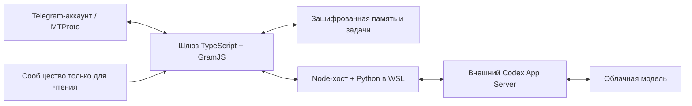

# Нейробро

**AI-ассистент, который участвует в Telegram-беседах через обычный пользовательский аккаунт по MTProto.**

Нейробро связывает Telegram-аккаунт с агентным окружением: контекстом разговора, памятью, инструментами и длительными задачами. **Создавать бота в BotFather и получать токен Bot API для этого подключения не нужно.**

Нейробро использовался в режиме **24/7 на Windows/WSL**: фоновый запуск без открытого терминала, сохранение состояния и механизмы восстановления после прерываний.

Проект разработан с активным использованием AI coding agents. Автор определял поведение продукта, направлял архитектурные решения, координировал разработку и проверял результат в реальных Telegram-группах.

[English](README.md) · [Архитектура](docs/architecture.md) · [Изоляция модели](docs/isolation.md) · [Инженерные решения](docs/design-notes.md) · [Проверки и запуск](docs/testing.md)

## Возможности

- **Участие в беседе.** Прямые обращения и реплаи, оценка продолжения разговора, настраиваемая инициатива и решение промолчать.
- **Контекст и память.** Недавние сообщения, выбранные реплаи, собственные действия, сохраняемые заметки, предпочтения и обратная связь. Контекст собирается в пределах бюджета.
- **История и поиск.** Поиск по запросу и датам, чтение соседних сообщений, анализ длительных периодов с сохранением промежуточных результатов и учётом покрытия.
- **Медиа и действия Telegram.** Работа с изображениями, интеграция генерации, доставка файлов и медиа, участники, опросы, реакции и ограниченные действия с профилем и группой.
- **Длительные задачи.** Сбор материалов, разбор, отдельное составление и проверка итогового отчёта, отправка результата частями.
- **Восстановление.** Зашифрованное состояние и журнал действий, сохранение прогресса, завершение процессов и сверка неопределённых результатов перед повторением операций.
- **Разные роли чатов.** Рабочая группа для общения и отдельно подключённое сообщество только для чтения. Контекст разных групп изолируется.

Конкретные инструменты зависят от окружения, провайдера модели и прав аккаунта. Реализованный инструмент и проверенный живой сценарий — разные уровни подтверждения; результаты проверок приведены в [документации](docs/testing.md).

## Подключение через аккаунт

Шлюз использует **GramJS / MTProto**, ключи Telegram-приложения и авторизованную сессию пользовательского аккаунта. Такой способ подключения позволяет работать с доступной аккаунту историей и поиском, а также с объектами Telegram через специальные инструменты.

Для ассистента предусмотрен отдельный аккаунт. Доступ привязывается к конкретным чатам: группа, куда можно отвечать, отделена от источника, который разрешено только читать. Запрет записи обеспечивается на уровне инструментов, а не одним пожеланием в промпте.

## Как устроен



Основная логика находится в `packages/telegram-gateway`. Мост к модели и управление процессами — в `project/verification`. В `crates` находятся собственные Rust-компоненты Windows-изоляции и запуска; связанные TypeScript-контракты — в `packages/rm0032-phase3-runner`.

**Codex App Server написан на Rust сторонним разработчиком и используется как зависимость.** Наш действующий мост к нему — Python/Node. WSL содержит окружение исполнения, сами веса модели работают у провайдера.

## Проверить исходники

Нужны Node.js 24.15+ совместимой ветки 24.x, npm 11, Git и Python 3.12+.

```sh
cd packages/telegram-gateway
npm ci --ignore-scripts
npm test
```

Проверки используют синтетические сообщения и временные хранилища. Telegram-аккаунт и вызовы модели для них не нужны. Путь к Python можно задать через `NEUROBRO_TEST_PYTHON`.

Для живого запуска дополнительно настраиваются модельное окружение, WSL, Telegram-сессия и привязки чатов. В репозитории опубликованы исходники и примеры устройства рантайма; готовый универсальный установщик в состав публикации не входит.

## Разработка с AI-агентами

AI coding agents участвовали в реализации, создании тестов и ревью. Автор проекта отвечал за концепцию, требования, выбор и пересмотр архитектуры, координацию работ и приёмку результата. Реальное использование в группах помогало проверять целые сценарии: от поступления сообщения до доставки ответа или файла.

Опубликованы код и синтетические примеры. Переписки, данные участников, ключи, сессии и внутренние журналы эксплуатации исключены. Лицензия для собственного кода пока не выбрана; сведения о сторонних компонентах — в [THIRD_PARTY.md](THIRD_PARTY.md).
