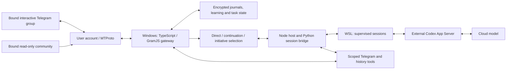

# Architecture

## Telegram account and chat roles

The gateway uses a Telegram user account through GramJS/MTProto, not a BotFather identity or Bot API polling. One account/client owns the interactive-group connection. An optional separately bound community source is read-only; peer and method checks constrain source access and outgoing actions. The account's Telegram permissions still apply.

Direct requests take priority. A contribution following an assistant message can be assessed as a continuation. Optional initiative has explicit silence decisions and own-output cooldowns. Saved learning and feedback influence context and behavior; they do not grant new tool permissions.

## Context, search and memory

Recent source messages, reply anchors, own-action facts, learned notes and preferences and task progress have separate provenance. Context is assembled under budgets rather than appending the entire archive to every prompt. Chat search supports query/date filters, paginated cursors and surrounding context. A source reference is not proof that media pixels or a deleted message remain retrievable.

The interactive group and read-only source have distinct roles. Source observation and alerts are separately controlled; messages from the source do not become authority to send there. Profiles keep unrelated group context isolated.

## Long-running history analysis

History tasks persist pages, coverage, analysis nodes and operation state. Analysis can pack multiple fragments into larger model inputs and use admitted parallel workers while retaining intermediate results. Foreground conversation and background work share finite resources. Saved progress enables continuation without asking the model to reread everything on each request.

Finalization is a separate stage: draft a report from saved analysis, review it, and allow a bounded correction before accepting a final artifact. The report is delivered through a multipart outbox. Lifecycle validation does not establish that every factual statement in the generated report is correct.

## Model room

The project provides host/guest supervision, private transport, scoped model sessions, tool dispatch and cleanup. Python runs inside WSL; Node connects it to the Telegram service. The external Codex App Server invokes a cloud model. WSL hosts the runtime, not model weights.

The published Python/Node sources include image collection, request/response handling, process ownership, parallel session support, egress relay and shutdown coordination. A compatible Codex runtime and environment-specific configuration are required. Version/hash contracts prevent silently mixing incompatible components.

## Actions and recovery

Actions pass through admission, fresh request validation, dispatch, readback, persistence and cleanup. Known pre-dispatch failures differ from uncertain outcomes after dispatch. Unknown delivery remains recorded rather than being blindly replayed. Profile/avatar requests are revalidated immediately before mutation, including after upload.

Recovery uses persisted progress and evidence that the previous owner has settled. Saved sibling results can survive interrupted parallel work; supported failures may obtain bounded successors. Ambiguous cases can still require explicit reconciliation. These mechanisms are not an exactly-once-delivery guarantee.

## Original Rust components

The three Windows Rust crates implement runner, native observation and launcher/prestart hardening experiments, with paired TypeScript contract fixtures. They are distinct from the active Python/Node-to-WSL path. Codex App Server is an external Rust dependency, not code authored in this repository.

## Deployment boundaries

The source tree includes offline tests and runtime references, not a portable installation image. Telegram credentials, chat bindings, model authorization, WSL provisioning and private runtime state are configured separately. Context budgets, media availability, provider behavior and Telegram permissions bound the resulting assistant's capabilities.
