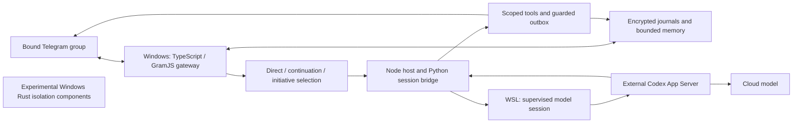

# Architecture

## Conversation ownership

One bound Telegram account/client serves one group. Direct requests take priority. An unthreaded contribution following a recent assistant message can be assessed as a continuation; this does not prove that it addresses the assistant. Optional initiative can return an exact silence decision. Confirmed own output delays subsequent initiative.

Context is assembled under budgets. Recent source messages, selected reply anchors, own-action facts and task observations have distinct provenance. A cached fact is not proof that an object is still available. Long-history tasks read and summarize incrementally, record coverage and keep explicit gaps instead of claiming to have read an entire period.

## Model room

Our room is the host/guest supervision, private transport, scoped model sessions, bounded packets, tool dispatch and cleanup protocol. Python runs inside WSL; Node connects it to the Telegram service. The external Codex App Server calls a cloud model: model weights are not hosted by this repository.

The published Python/Node sources include image collection, native request/response handling, session ownership, egress relay and shutdown coordination. They depend on a separately installed compatible Codex runtime and environment-specific configuration. Recorded source hashes intentionally refuse mismatched components.

## Actions and failure handling

An action is more than a tool declaration: admission, fresh request validation, dispatch, readback, persistence and cleanup form its lifecycle. Known failures before dispatch differ from uncertain outcomes after dispatch. Unknown delivery is retained rather than automatically retried. Profile/avatar mutations revalidate their originating request immediately before applying the change, including after upload.

## Rust components

The three Rust crates implement a Windows runner, native observer and native launcher/prestart hardening experiments. They use Windows APIs and share contract fixtures with the paired TypeScript package. They are separate from the current WSL model path; an `app-server` binary in that path is third-party software.

## Limits

The model can still misjudge when to speak. Bounded memory is not lossless recall. Old image retrieval depends on the available reference/ancestry. Artifact references and durable poll objects have different lifetimes. Foreground and history work share finite resources. The repository is not a generalized autonomous desktop agent or a portable production appliance.
