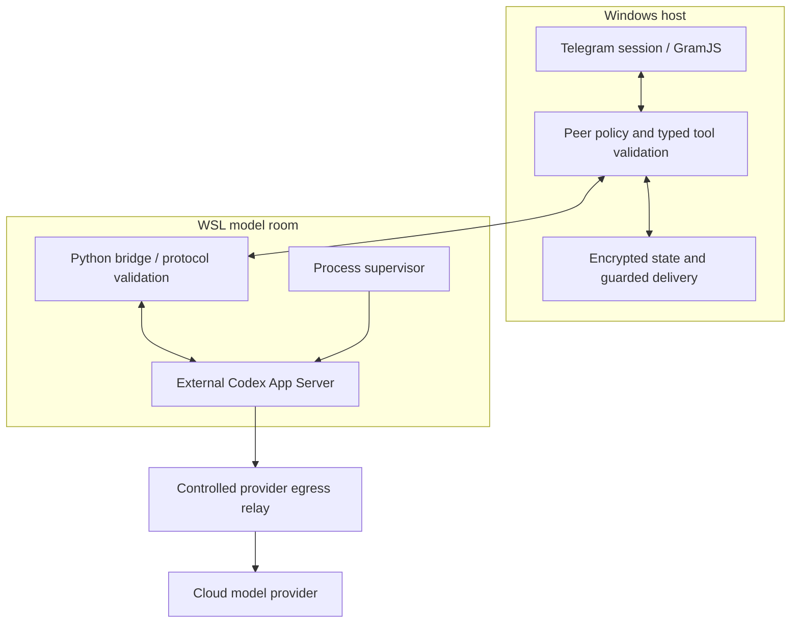

# Model room and containment

Neurobro separates the Telegram-facing Windows host from the model runtime in WSL. The model requests narrowly defined operations through a bridge; it is not handed a general Windows shell or unrestricted access to the user's files.

## Controls in the active runtime design

| Layer | Implementation |
| --- | --- |
| Model permissions | Explicit filesystem profile: root denied, selected runtime/workspace reads admitted, authentication paths denied; network disabled in the model permission profile and shell environment inheritance disabled |
| Capability selection | Fixed workspace and permission profile, empty environment/capability-root selections, disabled general shell/apps/plugins features in the reviewed session configuration |
| Tool bridge | Host-registered dynamic tools with argument validators; returned session permission profile and working directory checked before use |
| Telegram authority | Windows gateway owns the authenticated session and enforces target peers, read-only source policy, request validation and operation state |
| Process containment | The Linux supervisor configures NoNewPrivileges, empty capabilities, ProtectHome, ProtectSystem=strict, PrivateTmp, resource limits and control-group termination |
| Provider connection | Separated local egress relay with configured authority/DNS restrictions; the provider connection is intentional, not an unrestricted model networking capability |

The relay carries opaque CONNECT traffic. It does not inspect TLS payloads or enforce HTTP-path restrictions. Web and image tools can be separately enabled by the host; 'network disabled' in one layer is not a claim that the entire application never accesses the internet.

Source entry points:

- [Managed custody client](../project/verification/rm-0032-managed-custody-client.py): server arguments and filesystem/network permission profile.
- [Reviewed model session](../project/verification/rm-0032-astra-canary-client.py): thread/turn configuration and feature restrictions.
- [Native conversation](../project/verification/rm-0032-native-conversation.py): session validation and host-selected tools.
- [Linux supervisor](../project/verification/rm-0032-managed-custody-supervisor.py): service isolation and lifecycle.
- [Egress relay](../project/verification/rm-0032-model-egress-relay.py): provider transport boundary.

## Our Windows Rust components

The repository also contains an earlier, separate Windows-native containment track. These are original project sources, not the external Codex App Server:

- [Runner](../crates/rm0032-phase3-runner): Windows Job Objects, suspended/no-window process launch, resource controls and process settlement.
- [Native observer](../crates/rm0032-phase3-native-observer-v1): canonical requests, exact path checks, non-reparse ancestry and read evidence.
- [Observer launcher](../crates/rm0032-phase3-native-observer-launcher-v1): restricted tokens, low integrity, suspended CreateProcessAsUser launch, DACL/file-identity checks and explicit handle/job ownership.

The Rust prototypes are not presented as the active WSL security layer. Their contracts and fixtures are published so the native process work can be inspected separately.

## What the boundary means

These controls depend on a compatible Codex build, guest permissions and launcher configuration. WSL by itself is not the security contract. Offline source tests demonstrate particular policy and lifecycle behavior; they do not certify an arbitrary workstation, prove an exploit-proof sandbox or assert that every host's WSL mount/interop configuration is identical.

A live deployment must configure and verify those boundaries. Credentials, installed binaries, WSL images and private operational evidence are intentionally not shipped in the public repository.
