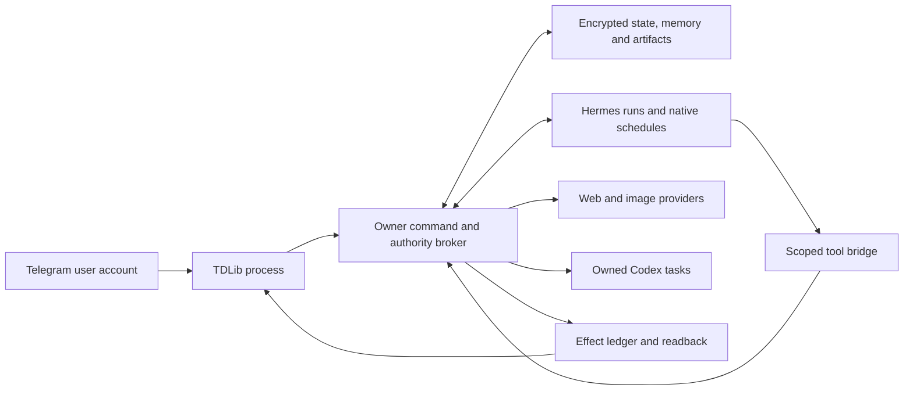

# Neurobro personal agent

**Development source snapshot — 7 October 2026.** This public copy is bound to the byte manifest recorded in [PERSONAL-SOURCE-ADMISSION.json](../../PERSONAL-SOURCE-ADMISSION.json). It is separate from the historical GramJS/Codex App Server group assistant. Live activation and provider/account acceptance remain separate. See [public validation](../../PERSONAL-VALIDATION.md).

Hermes is the external Nous Research engine, used at a pinned commit; its modified source overlay retains the MIT notice. The TDLib schema retains the Boost 1.0 notice. This project supplies the broker, bridges and integration, with AI-assisted implementation; it does not claim authorship of these upstream engines. See [third-party attribution](../../THIRD_PARTY.md).

A personal Telegram assistant operating through a real user account. A TypeScript broker connects a supervised TDLib client to the pinned Hermes execution engine. The broker owns identity, permissions, original files, canonical preferences and receipts for external actions; Hermes owns model runs, sessions and schedules.

This package is an independent composition. It does not adopt the historical group assistant's account session, memory, services or Hermes pilot. Source tests use isolated profiles and substitute external services. They do not establish live account/provider readiness.

## Conversation

Owner commands begin with `/бро`. The account and sender must match the authenticated owner; forwarded messages, bot-origin messages and the assistant's own outputs cannot issue commands.

| Owner action | Behaviour |
|---|---|
| `/бро найди информацию по этому вопросу` | Create a durable task; return results to the configured private control destination. |
| `/бро --here ответь на вопрос` | Explicitly select the originating chat for this task's response. The marker must lead the instruction; quoted or negated phrases do not change routing. |
| Reply to a task's output with another `/бро …` instruction | Associate the correction with that task; preserve unrelated tasks and require the previous execution to settle. |
| Status or cancellation command | Use the broker's saved task/run state instead of starting a model just to report status. |
| Edit or delete the source command | Reconcile the actual message, invalidate stale context and withdraw old execution authority. |
| `/бро запомни глобально: <exact preference>` | Admit an explicit enduring owner preference after checking its current source. `запомни здесь:` scopes it to the source chat. |

Telegram permissions are capabilities over exact resources. Default write authority covers sending text/media to the selected route. Additional destructive/profile/group actions require explicit configuration grants. A model cannot promote quoted text or its own answer into owner authorization.

## Implemented surfaces

- **Telegram:** history, search, messages and reply context; participants; media and documents; polls and results; reactions; bot buttons; scheduled sends; selected profile/group operations. All operations pass the broker's current resource grant. The protocol adapter verifies observable effects where possible and retains uncertain outcomes.
- **Files:** encrypted originals, immutable revisions and provenance; task-scoped staging; JSON, CSV, text, DOCX and XLSX inspection with explicit coverage. OOXML decoding uses the configured Python executable and bounded standard-library parsing. PDF needs an explicitly supplied decoder; video/audio content understanding is not implied by file transport.
- **Memory:** encrypted sources, scoped retrieval, bounded context construction, canonical explicit preferences and procedure candidates. Source revisions, retractions and forgetting invalidate dependent context and files. Retrieval indices are rebuildable; message history is not pasted wholesale into every request.
- **Web:** configured search, guarded fetch and download, with redirect/DNS checks and task-owned downloaded artifacts. Search needs a configured provider. Web content remains data and cannot issue account commands.
- **Multiple tasks:** persistent intent/run bindings, private default routing, responsive status/cancel intake, revision controls, restart reconciliation and no automatic duplicate send after an uncertain outcome.
- **Recurring work:** Hermes native cron through a versioned pinned-source extension, fresh authority before each execution, exact output manifests and broker-owned delivery. Cron is optional; stock Hermes without the required seam is refused. Jobs provide scoped collection/filtering/deduplication; capacity is an explicit condition, not silent eviction.
- **Computer work:** a separate owned Codex App Server adapter for configured projects and tasks. Existing arbitrary Desktop chats are not automatically attached. Executable work requires the adapter's admitted OS-boundary evidence; a working directory alone is not a sandbox.
- **Operations:** isolated profile preparation, offline doctor, masked local login, single-owner process lease, windowless Windows supervisor, encrypted backup/restore and STOP/reconciliation gates.

Image viewing and generation are broker capabilities with task-scoped original references. Generation/editing uses an explicitly configured compatible image provider and its own credential; a ChatGPT login is not automatically an image API credential. Generated outputs are saved as versioned artifacts before Telegram delivery. Provider/model image capability still requires live acceptance.

Schedules belong to private-route tasks. A short-lived `--here` response does not grant recurring access; create the recurring task privately. Current private grants expire after seven days and public-response grants after fifteen minutes. Context refresh preserves expiry and authority. Each new cron execution builds a separate fresh context; its native prompt requests `context.current` before work. This is a model instruction, while the tool/effect authority checks are enforced in code.

Monitoring begins with an explicitly bounded recent snapshot, then follows new heads and catches up through persisted cursors. Telegram gaps cannot be interpreted as proof that history is complete. An empty initial source or a missing committed boundary can therefore require reconciliation. The retained item/version ceiling is explicit (default 4,096, configurable to 10,000); a blocked monitor reports its counts and can resume at the same page after a permitted increase. There is no claim of unlimited unattended retention or gap-free recovery in every Telegram state.

## Execution and recovery



Every tool call uses a host-issued opaque execution credential. Task IDs, grants, destinations and credentials supplied by model text have no authority. Intent revisions and revocations are checked again before effects. Recurring executions have separate effect identities while retries within one execution retain their identity.

An interrupted request may have succeeded externally. Such outcomes remain `unknown` and require reconciliation; they are not reset to a new operation. Cancellation revokes subsequent authority but does not claim to undo an already transmitted external action. A completed model run is distinct from a verified delivered result.

## Run and verify

Node 24.15+ is required for native TypeScript execution and SQLite. Repo-local development dependencies are pinned in `package-lock.json`.

```powershell
npm ci --ignore-scripts
npm run typecheck
npm test
node src/cli.ts help
```

See [operations](docs/operations.md) for exact source/runtime pins, fresh profile creation, doctor, native TDLib preparation, separate provider authentication, windowless launch plans and recovery. See [Hermes cron extension](tools/hermes/CRON.md) for the optional pinned patch. Examples contain placeholders, never credentials.

Live activation additionally needs a verified TDLib binary, the isolated Hermes environment/provider, the owner's account login and exact private-route readback. Test fixtures are not substitutes for those checks. No old service is restarted by installing or testing this package.
